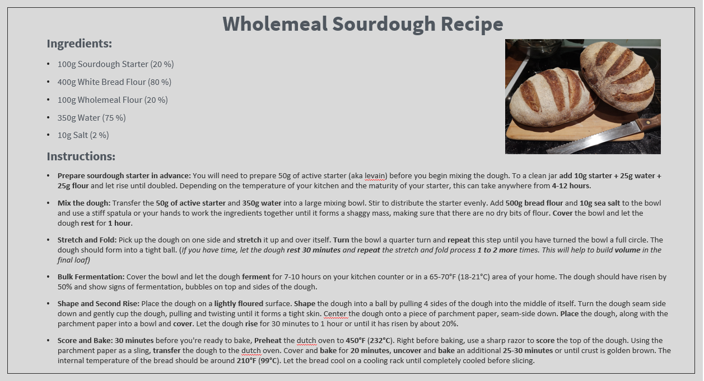
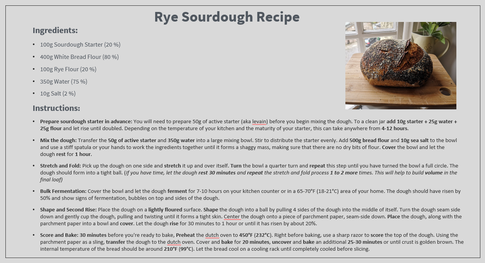
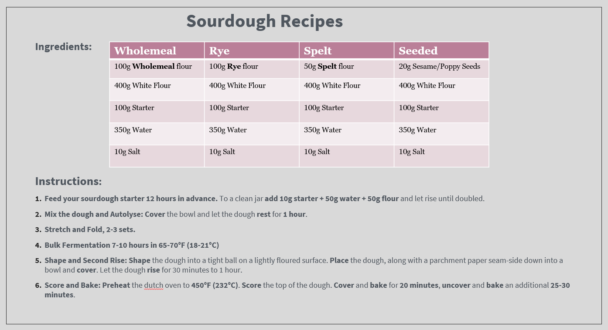
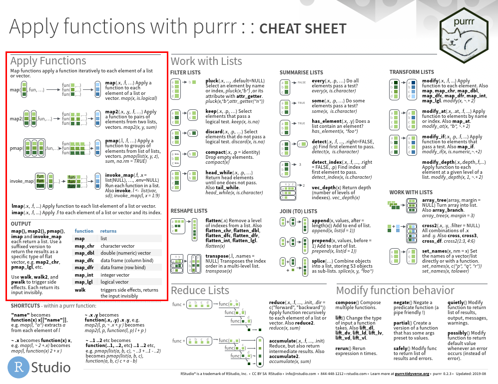

###### _Created by Fabian Kalt_, s1968412@ed.ac.uk

### Tutorial Aims

#### <a href="#section1"> 1. Explore the differences between `for()` loops and `map()` functions</a>

#### <a href="#section2"> 2. Find answer to the question of 'Are `for()` loops bad?'</a>

#### <a href="#section3"> 3. Explore mapping functions within the Purrr package</a>


---

All the resources for this tutorial can be downloaded from [this Github repository](https://github.com/EdDataScienceEES/tutorial-FabiKalt). Clone and download the repo as a zipfile, then unzip it.

---


## 1. Introduction
Welcome to this workshop where we explore the question of ‘Are `for()` loops really that bad?’. This tutorial builds on basic knowledge on `for()` loops, particularly on the Coding Club tutorial [Intro to Functional Programming](https://ourcodingclub.github.io/tutorials/funandloops/) and is designed for those who want to delve a bit deeper into functional programming and take a look at what happens behind the scenes. Have you ever wondered why many coders in the R universe consider using `for()` loops bad practice? We learned previously in the Coding Club tutorial that `for()` loops are a great tool to minimise replication of code by allowing us to run the same operation on a group of objects. We also covered, that `for()` loops can get a bit slow if complex functions or large data datasets are involved and that they might be more difficult to read compared to other methods of functional programming such as the `apply()` functions for example. But what really is the difference between `for()` loops and other functional programming methods? In this tutorial we will tackle this question and take a look behind the scenes of functional programming. To explore this question we will compare `for()` loops with the `map()` functions of the Purr package, using a personal real life analogy of bread baking.


## 2. Bread Recipes

In order to visualize the difference between `for()` loops and other functional programming methods, I would like to diverge from the coding world for a bit and take a dip into a hobby of mine – sourdough bread baking! During the first Covid-19 lockdown in spring 2020, like many others, I took up bread baking to make good use of the fact that I was home every day. After achieving some decent results (see photos in the recipes below!) and a little bit of experimenting with different bread recipes, I noticed that a lot of the recipes were very similar and only changed a little between different bread types. Now, since baking sourdough bread is quite an elaborate process (the first mixing of the dough to retrieving a fresh sourdough loaf from the oven it takes about 36 hours!), there are a lot of steps involved and as such the recipes in the cookbook can be quite long. This is an example of two recipes, one for a wholemeal sourdough and one for a rye sourdough bread:

\
\




\
Can you spot the difference? Exactly, only the flour input changed. But still, we have all this text for the remaining steps. Let's try to make this recipe more efficient by generalising the recipe and removing unnecessary lines of text.

\


Let’s keep that in mind for now and move back to the coding world.

\
\
<a name="section1"></a>

## 3. `for()` loops and `map()` functions

For the coding part of this tutorial, we will be using data from an experiment I conducted during lockdown on the rising time of doughs. I explored how long the dough needs to proof in order to grow to double its size, depending on the composition of flour and the temperature of the environment.

---

**Background info on dough behavior:**

_An essential part of bread making is to give the dough time to rise. This process is called proofing. Flour, water and yeast is mixed. The yeast bacteria feeds on the sugars in the flour and multiply. This chemical reaction releases CO2 gas which ideally gets captured in the developed gluten structure of the dough. This gives the bread its rise during the proof and later on makes the bread rise in the oven and also guarantees a fluffy and airy crumb of the bread. This chemical reaction is sped up by warmer temperatures during the proofing process. The flour type used also has an impact on the reaction speed as the sugars in the flour are more or less accessible for the yeast bacteria to process. Note that the temperature not only affects the proofing time but also affects the taste! (e.g. a slow proof makes for a heartier and more tangy bread)_

---
\
Without further ado, let’s get started with the code.

First, we install and load the Purrr package, which is part of the tidyverse package.


```
# Load libraries
library(tidyverse)
```

Then we load the dataframe and explore it.
Remember to set the working directory to where you extracted the `.Zip` from the Github repository to.
You can do this via `setwd()`.

```
# Set the working directory
setwd("your_filepath")

# upload dataframe
breadproof <- read.csv("02_data/df_bread_proofingtime2.csv")

# explore
str(breadproof)
head(breadproof)
```

We will use this simple dataframe to illustrate the differences between `for()` loops and `map()` functions. The dataframe shows the amount of time required for the dough to reach twice its size for each of the 10 bread types and for 7 different temperature levels. We then use two `for()` loops to summarize the values.

```
# summarize proofing time values via `for()` loops
# loop Nr. 1
bread1 <- vector("double", length(breadproof))
for(i in 1:length(breadproof)) {
  bread1[[i]] <- mean(breadproof[[i]], na.rm = TRUE)
}

# loop Nr. 2
bread2 <- vector("double", length(breadproof))
for(i in 1:length(breadproof)) {
  bread2[[i]] <- median(breadproof[[i]], na.rm = TRUE)
}
```
Can you make out what this loop does? What is the difference between the two code chunks? Please take a moment to have a think before you continue.
Here we first define that the outputs are slotted into a double (numeric with decimal points) vector with the length of the columns in the data frame. Then, we define how many iterations of the variable are performed and lastly, we add the output destination ‘bread1/2’ and the summary function ‘mean’ or ‘median’ that should be performed for i.

The only difference between the two loops are the ‘mean’ and ‘median’ functions and of course their respective output objects, the rest of the code is the same in both cases. There is a lot of code between those two `for()` loops but only a few words changed. This seems inefficient and it is difficult to make out the difference between the two code chunks on the spot.

This reminds us of the bread recipe example where initially it similarly was difficult to make out the differences between the recipes due to too much text that was the same between two recipes. Luckily, what we did with the recipe to improve efficiency and readability, we can do with our `for()` loop codes as well.

```
# map() function version
bread_1 <- map_dbl(breadproof, mean, na.rm = TRUE)
bread_2 <- map_dbl(breadproof, median, na.rm = TRUE)

bread_1
bread_2
```


`map()` functions are easily combined with pipes!

```
# Easily combined with pipes
bread_1 <- breadproof %>% map_dbl(mean, na.rm = TRUE)
bread_2 <- breadproof %>% map_dbl(median, na.rm = TRUE)
```

The `map()` function in this case takes each element of the breadproof dataframe, computes the mean or median of it and saves the results as a double vector. The output is the same as the `for()` loop output above. With the `map()` function though, it is very clear what this function does and the difference between the two is easily identified. With the `map()` function from the Purrr package, only those actions that change between the applications are kept visible in the code and are thus easy to spot.

<a name="section2"></a>

Now, let’s take a look behind the scenes and explore what the map function actually does:

```
# Behind the scenes of map() function
map_dbl <- function (x, f, ...) {
  ouput <- vector("double", length(x))
  for(i in length(output)) {
    output[i] <- f(x[[i]], ...)
  }
  output
}
```
Does this look familiar? Yes, this looks like a `for()` loop! The `map()` function basically is a generic `for()` loop written as a function instead of specific `for()` loop for specified variables. That means, when we use a `map()` function, we simply specify the x (our breadproof dataframe in this case) which behind the scenes gets inserted in the `for()` loop. The `map()` function essentially builds on top of `for()` loops.

---
**Note:**

This is only to visualise how `map()` functions work, the actual code behind the `map()` function is different and is done via C++ for various efficiency reasons.

---

Referring back to our bread recipe example, we can see that we took the same steps to make the recipe or the code more efficient by generalising most of its text or code. Instead of writing a complete `for()` loop every time, you get a function that does it for you.

## 4. Conclusion
We can now say for certain that `for()` loops in themselves are not bad at all, as loops are essentially what we are using in functional programming as well. The difference lies in efficiency improvements and better readability when using the `map()` function, as well as a reduction in a possible margin of error by avoiding additional lines of code. Exploring the what the functions in code packages actually do helps us understand our code better and gives us more confidence when we use those packages in the future. Hopefully, this tutorial gave you a useful insight in the differences between `for()` loops and functional programming and more generally illustrated the importance of taking a look ‘behind the scenes’ and understanding what the code actually does.

<a name="section3"></a>

## 5. Mapping with the Purrr package
Take a look at the very useful <a href="https://github.com/rstudio/cheatsheets/blob/master/purrr.pdf" target="_blank">Purrr cheat sheet</a> and focus on the ‘apply functions’ on the left side.
\
\

\
\
\
\
You can see that there are several iterations of the `map()` functions, which can be split into two categories:
#### 5.1	Specifying the output:

We can add suffixes to our `map()` functions depending on what type of output we want. For example, the pure `map()` returns the output as a list and map_int() returns the output in the form of an integer vector. Let's take another look at what happens behind the scenes here:

```
# Behind the scenes of map_int() function
map_int <- function (x, f, ...) {
  ouput <- vector("integer", length(x))
  for(i in length(output)) {
    output[i] <- f(x[[i]], ...)
  }
  output
}
```
The difference to our previous code with the map_dbl() function is only in the specification of the output vector, which is now specified to be an integer vector.


#### 5.2	Specifying the input:

We can also modify the input for our `map()` function. For example, map2() applies a function to pairs of elements from two lists or vectors.

```
# Behind the scenes of map2() function
map2 <- function (x, y, f, ...) {
  ouput <- vector("list", length(x))
  for(i in length(output)) {
    output[i] <- f(x[[i]], y[[i]], ...)
  }
  output
}
```
The difference here is that two variables are called upon in the function (x and y, instead of only x previously). This allows the function to be applied to pairs of elements from both variables.


## Challenge yourself:
If you want to learn more about the different iterations of the `map()` function and get some practical experience, here is a little challenge for yourself. Use different iterations of the `map()` function from the Purrr package and try to build a generic code that would work as this `map()` function. Basically, create a 'behind the scenes' code of the following `map()` functions in question as we did above. You can use the <a href="https://github.com/rstudio/cheatsheets/blob/master/purrr.pdf" target="_blank">Purrr cheat sheet</a> for some help on the `map()` functions.

1.	Create a character vector as output
2.	Create a logical vector as output
3.	Apply a function to pairs of elements from two lists
4.	Apply a function to pairs of elements from two lists and create a double vector as output


See [Challenge Yourself Script](https://github.com/EdDataScienceEES/tutorial-FabiKalt/blob/master/01_script/loops%20and%20maps_tutorial_FK.R) for solutions.


## Tutorial outcomes
1. You know the differences between `for()` loops and `map()` functions and what happens behind the scene.

2. You learned that `map()` functions are essentially efficient `for()` loops.

3. You can use the mapping functions within the `Purrr` package for functional programming confidently.


## Resources

For more on `for()` loops and `map()` functions, read the official <a href="https://github.com/rstudio/cheatsheets/blob/master/purrr.pdf" target="_blank">Purrr cheat sheet</a>. If you are looking for a comprehensive guide for R, take a look at <a href="https://r4ds.had.co.nz/iteration.html#the-map-functions" target="_blank">R for Data Science by Hadley Wickham & Garrett Grolemund</a>, which includes a lot of information about `for()` loops and the `map()` functions of the Purrr package.
